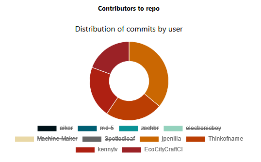
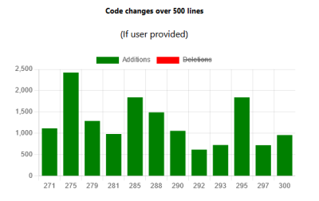

# Metric Visualization

Scroll down for screenshots/demo

Dependencies:
- `charts.js` and `react` for ui
- `@octokit/rest` to query GitHub API

## Setup

Required: nodejs/npm and api token.

### Authentication

1. Create a blank file `.env` in the root.
2. Write inside `REACT_APP_SECRET=yourtokenhere`
3. Sign in, go to settings\\developer settings.
4. Generate a Personal Access Token specifically.
5. Copy the token and paste it into the file.

### Startup (Without Docker)

If docker is preferred, go to the next section.

```
$ npm install
$ npm start
```

### Startup (Using Docker)

#### Options
- Docker
- Compose
- Scripts

#### Manual instructions:
1. Open a terminal in `./src`
2. Run `docker build -t sample .`
3. Open the container

Example in a bash terminal:

```
$ docker build -t sample .
$ docker run \
> -it \
> --rm \
> -p 3000:3000 \
> -e CHOKIDAR_USEPOLLING=true \
> sample
```

#### Compose instructions:
1. `docker-compose up`
2. `CTRL+C` to exit

```
$ docker-compose up
```

#### Scripts instructions:
1. `quickstart.bat` for easy startup
    - Open in file explorer on Windows
    - `quickstart.bat` in cmd
2. `quickstart.sh` for easy startup
    - Open in file explorer on Windows
    - `./quickstart.sh` in bash terminal
    - `./quickstart.sh` in powershell
3. `CTRL+C` to exit

#### Viewing

The app is viewable at `http://localhost:3000`

## Demo

### Screenshot 1

How the web app looks when started.


### Screenshot 2

Chartsjs comes with interpolation.\
For nicer looking line graphs.


### Screenshot 3

Some analysis I did on this repo.


### Screenshot 4

Moving onto another repository...\
`lmammino/public-transport-ireland`\
Going in order up/down left/right:
1. lmammino's repo gets attention
    - radar emphasizes watching/starreds
    - also a fair size rating
2. lmammino took a week break
    - timeline shows a gap between commits
    - dates describe that gap well
3. lmammino had little help
    - could have not been collaborative
    - could be efficient on their own
4. lmammino is familiar with typescript
    - also making use of shell utilities
    - interesting takeaway about hobbies


### Screenshot 5

Another repo `imdbpy`:
1. Lots of traffic, forks & commits
    - issue also show engagement
    - peaked watching rating
2. Curve of commits late August
    - potential development cycle
    - shows organization skills
3. Two users share most of traffic
    - pair programming perhaps
4. Distinct focus on python
    - makefile takes little space
    - makes sense it would


### Screenshot 6

In the same repo from screen 5...\
View of a commit at 9pm
- Peer into work ethic
- Conversely, bad habits


### Screenshot 7

The repository `microsoft/terminal`.\
Nice example of a good rating.
- Peak ratings besides size
- Size was made to have a steep curve
- Still, smaller code can be a good thing
- Left to the user to interpret the graphs


### Screenshot 8

Another look at the statistics.


### Screenshot 9

The repository `git/git`.\
Large codebase, good ratings.\
- Healthy distribution of users/langs.
- Commits come in spikes
- Helps avoid clutter


### Screenshot 10

Clear view of the most active contributors.


### Screenshot 11

Nice and slightly different repo.


### Screenshot 12

Another repository, cool stats.


### Screenshot 13

Repository with steady production.
- Consistent commits past two weeks.
- Use of a trio of core langs.


### Screenshot 14

Example of filtering data.\
Click entries in the legend.



### Screenshots 15-20

Added new features:
1. Time interval input
2. User account input
3. Commits for interval
4. Issues chart
5. A/D chart

\
\
\
\
\
